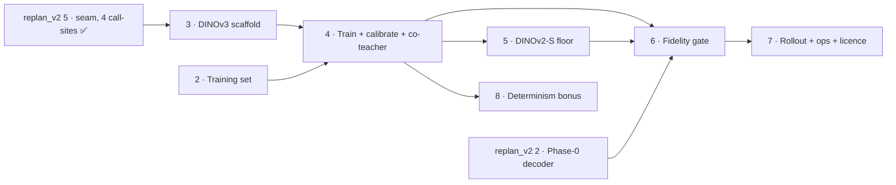

# DINOv3-SAT Scorer Swap — Execution Tracker

Source PRD: [`../dinov3_sat_scorer_backbone_prd.md`](../dinov3_sat_scorer_backbone_prd.md)
(READY — grilled Q1–Q10, 2026-06-30; **amended 2026-07-03** by the v2
program's §D12 — corrected inputs landed in the PRD and issues 02/03/04/06/07
via [`replan_v2/ISSUE-12`](../replan_v2/ISSUE-12-student-prd-amendments.md))

**Goal:** swap the install-date presence scorer backbone from hosted Gemini to a
self-hosted **frozen DINOv3-L-SAT** encoder + light head, **distilled from
Gemini's own per-vintage labels**. Primary deliverable = reproducibility (kill
version drift). Success is measured as **fidelity to Gemini, not accuracy** — no
independent install-date ground truth exists.

This effort is tracked as markdown issues in this folder. The repo plans entirely
in `docs/` markdown and the GitHub issue tracker is unused (PRD → Further Notes).

## Status legend

- ⬜ not started · 🟡 in progress · ✅ done · ⛔ blocked (a dependency is still open) · ➡ superseded (tracked elsewhere)

## Slices

| # | Slice | Status | Blocked by | Issue |
|---|-------|--------|-----------|-------|
| 1 | PresenceScorer seam — **superseded 2026-07-03** by [replan_v2 ISSUE-05](../replan_v2/ISSUE-05-presence-scorer-seam.md) (wider scope: 4 call-sites) | ➡ | — | [ISSUE-01](ISSUE-01-presence-scorer-seam.md) |
| 2 | Distillation training set (harvest + chip re-download + split) | ✅ | — | [ISSUE-02](ISSUE-02-distillation-training-set.md) |
| 3 | DINOv3-L-SAT frozen scorer scaffold + selection flag | ✅ | [replan_v2 5](../replan_v2/ISSUE-05-presence-scorer-seam.md) ✅ | [ISSUE-03](ISSUE-03-dinov3-scorer-scaffold.md) |
| 4 | Train light head + calibrate abstain band (RunPod; + co-teacher dual-scoring) | ✅ | 2, 3 | [ISSUE-04](ISSUE-04-train-head-calibrate.md) |
| 5 | DINOv2 ViT-S/14 falsification floor | ✅ | 4 | [ISSUE-05](ISSUE-05-dinov2-floor.md) |
| 6 | Fidelity gate (three numbers, both backbones; baseline = Phase-0 decoder under D8) — **IN PROGRESS 2026-07-10**: offline harness landed (`c424efe`), verdict skeleton + tie-break locked pre-gate-2 (`3ad2655`), student re-render input contract locked (`a603e48`); gate run itself not executed; prep: [ISSUE-06-prep-2026-07-05](ISSUE-06-prep-2026-07-05.md) | 🟡 | 4 ✅, 5 ✅, [replan_v2 2](../replan_v2/ISSUE-02-changepoint-posterior-decoder.md) ✅ | [ISSUE-06](ISSUE-06-fidelity-gate.md) |
| 7 | Feature-flag rollout + ops profile | ⬜ | 6 | [ISSUE-07](ISSUE-07-rollout-ops-profile.md) |
| 8 | Bonus: deterministic run-to-run experiment (not gated) | ⬜ | 4 | [ISSUE-08](ISSUE-08-determinism-experiment.md) |

## Dependency graph



ASCII fallback:

```
        ┌──── replan_v2 5 ✅ ──► 3 ──┐
        │                            ▼
roots ──┤                            4 ──┬──► 5 ──┐
        │                            │   │        ▼
        └───────────────── 2 ────────┘   ├──► 6 ──► 7
                                         └──► 8 (bonus, not gated)
   (6 also needs 5 and replan_v2 2 — the Phase-0 decoder gate baseline)
```

Slice 1 was superseded by replan_v2 ISSUE-05 (done 2026-07-03), so slices 2
**and 3** are both unblocked roots now. Slice 6 gained an external dependency:
its no-answer-change baseline runs both pipelines through the Phase-0 decoder
(D12.vi).

## Execution waves

- **Wave A (parallel roots):** 2, 3 — the seam dependency is already ✅
  (replan_v2 ISSUE-05); run together.
  *Deviation note (2026-07-03):* the v2 PRD's phase-level ordering says
  "Phase 3 starts after 0 + 1 land (gate baseline + seam)". That is refined
  here to per-slice dependencies: the seam (Phase 1 side) is done, so slices
  2–3 may start; the Phase-0 decoder gates only slice 6 (its no-answer-change
  baseline, D12.vi) and must land before the fidelity gate runs.
- **Wave B:** 4 — after 2 **and** 3 (head training on RunPod).
- **Wave C (parallel):** 5, 8 — after 4.
- **Wave D:** 6 — after 4, 5, **and** replan_v2 2 (Phase-0 decoder).
- **Wave E:** 7 — after 6 (includes the pre-ship licence review).

## How to use this tracker

1. Pick a slice whose **Blocked by** entries are all ✅. Flip its status to 🟡.
2. Each issue is a **tracer bullet** — it must be verifiable on its own
   (its acceptance criteria pass: tests green / artifact exists / gate number
   reported) before it goes ✅. Check off criteria in the issue file as you land them.
3. On completion, flip the slice to ✅ here, append a dated line to the log, and
   re-scan for newly unblocked slices.
4. The **PRD stays authoritative** for decisions. If you deviate, record it as a
   note row below rather than silently editing scope.

## Decision invariants (carried from the PRD — do not drift)

- Frozen backbone, light head only. No full fine-tune in v1 (LoRA/PEFT only on gate failure).
- Distillation **matches** Gemini; accuracy is **out of the gate** (no truth exists).
- `scan_state.json` schema unchanged; `decision_source` values are additive.
- Gemini stays behind the same seam as fallback / A-B comparator; flag-gated, Gemini default until the gate passes.
- v1 = per-chip independent scoring, single global abstain band. Sequence-aware (c), census-GT reference exemplar (b), and per-sub-domain calibration are deferred.
- Region via explicit `region` + registry (ADR-0002). Weights + chips under `~/zasolar_data/`, not committed.
- **D12 amendments (2026-07-03) are binding:** label pool = 23,147 anchors /
  250,502 rounds (26,820 retired); `chip_targets.csv` is a hard re-render
  dependency; 27.6% `done_ambiguous_*` handled explicitly in stratification;
  training compute = RunPod; DINOv3 licence review pre-ship; gate baseline =
  Phase-0 decoder under D8 rules (hand-authored 0.74 retired); co-teacher
  dual-scoring = calibration instrument only. `pv_score` names only the seam
  field — on disk the field is `confidence`.

## Progress log

- 2026-07-10 — Slice 6 flipped 🟡: the student-vs-teacher offline fidelity
  harness landed (`c424efe`, `scripts/validation/fidelity_gate.py` + tests),
  the gate verdict skeleton with the pre-registered R1 tie-break is locked
  (`3ad2655`), and the student re-render input contract + render-drop policy
  addendum is locked pre-gate-2 (`a603e48`). **Gate 3 is already adjudicated
  EQUIVALENT** in the verdict skeleton (Δ = 0.029 pp < 1 SE ≈ 1.46 pp — the
  SAT/L bet is falsified on gate 3; locked from the ISSUE-04/05 artifacts,
  which predate the skeleton). Gates 1–2 (the actual run: reproducibility +
  bet-survival, both backbones) have not executed — ISSUE-06 header still
  says "Nothing below is done yet".
  Conditionality reminder (plan doc §5 P0-2): the verdict is conditional on
  banked96 geometry; Panel v2 re-render requires a cheap fidelity re-check of
  the winner, and a persisting tie defaults to DINOv2-S.
- 2026-06-30 — Tracker + 8 issue files created from the grilled PRD.
- 2026-07-03 — Slice 1 superseded by replan_v2 ISSUE-05 (seam landed across
  all four call-sites). D12 amendments landed in the PRD and issues
  02/03/04/06/07 (replan_v2 ISSUE-12): corrected label-pool counts,
  chip-manifest hard dependency, ambiguous-fraction stratification, RunPod
  compute, pre-ship licence review, gate re-based on the Phase-0 decoder
  under D8, co-teacher dual-scoring. Slice 3 unblocked; slice 6 gained
  replan_v2 2 (decoder) as a baseline dependency.
- 2026-07-05 — Slice 2 done: `build_distillation_set.py` (harvest +
  render-chips, 27 tests). 23,147 anchors / 298,239 post-dedup rounds across
  all four corpora (D12's 250,502 was an inconsistent subset — reconciled in
  the artifact README); 27.6% `done_ambiguous_*` retained as unusable;
  anchor-disjoint split 18,499/4,648; 800-anchor stratified subset re-rendered
  at `chip_geom_v2_tight12` (8,165 rounds, 763 unrecoverable drops recorded),
  idempotency + containment-band QA verified on real artifacts. Artifacts:
  `~/zasolar_data/geid_temporal/dinov3_distill_20260705/`. **Slice 4 (train
  head) is now unblocked** (2 ✅ + 3 ✅ — Wave B may start).
- 2026-07-05 — Slice 4 done: light head trained (frozen backbone) + calibrated
  on RunPod (RTX 5090, D12.iv). Winner **`nomarker_bilinear512_k6`** (input 512,
  center-pool-k 6, bilinear), band **lo=0.46/hi=0.50**, pinned at
  `~/zasolar_data/models/dinov3_sat/head_v1_20260705/` (sha256-verified). Honest
  **held-out report-half agreement = 0.797 @ 0.885 coverage** (calib-half 0.939
  is in-sample — ~14 pp optimism gap on an 82-anchor calib set; downstream cites
  0.797). Upscaling ablation: bilinear≡bicubic@256, 512/k6 wins by +0.42 pp, the
  marked arm (+0.6–1 pp) is a D4-forbidden diagnostic only. Co-teacher: 35
  strata, overall disagreement 0.237, per-stratum table archived for Phase-4.
  Weak spot: thin unusable-class recall (20/120 report rows). Two design
  decisions (unusable-class supervision via 1,252 quality rows composing D12.iii;
  marker-free `.nomarker.png` render, PRD D4) + a fixed latent CUDA scaffold bug
  recorded in ISSUE-04 execution notes. `score()` now emits the calibrated band
  (local GPU seam smoke green; 76 slice-4 tests pass). **Slices 5 (DINOv2 floor)
  and 8 (determinism bonus) unblocked — Wave C may start.**
- 2026-07-05 — Slice 5 done: DINOv2 ViT-S/14 falsification floor stood up
  entirely on the **local RTX 4070 8GB** (no pod — 22M-param backbone, peak
  VRAM ~0.37 GB), same seam, same ISSUE-02 splits, same ISSUE-04 recipe.
  Implemented as `Dinov2PresenceScorer`, a thin subclass of
  `Dinov3PresenceScorer` in `dinov3_scorer.py` (file-scope forbade a new
  module); patch size (14 vs 16) derived torch-free from the timm backbone id;
  `dynamic_img_size=True` added (byte-identical for DINOv3, required for
  DINOv2's non-518 default); registered additively as `dinov2_floor`/
  `dinov2_failed`, selectable via the existing `--scorer` flag with zero
  CLI-surface change (Gemini stays default). Winner **`nomarker_bilinear518_k6`**
  (same shape as slice 4's winner), band **lo=0.35/hi=0.41**, pinned at
  `~/zasolar_data/models/dinov2_floor/head_v1_20260705/` (sha256-verified).
  Honest **held-out report-half agreement = 0.7968 @ 0.8776 coverage, n=858**
  (calib-half 0.9495 is in-sample, not cited as headline) — cf. DINOv3-L-SAT's
  0.797 @ 0.885 (ISSUE-04); this slice does not judge the comparison, that's
  ISSUE-06's job. Seam smoke on real weights (GPU) green; 90/90 targeted tests
  pass (`test_dinov3_scorer.py` + `test_train_dinov3_head.py` +
  `test_dinov2_floor.py`). Cosmetic anomaly fixed pre-commit: the shared
  evaluate-report writer used to hardcode a "DINOv3 head ... (ISSUE-04)" title
  even when scoring the DINOv2 bundle (numbers/config in the body were always
  correct); the title now derives from `config.backbone_model_id`, and the
  pinned report was regenerated (verified byte-identical apart from the title).
  **Slice 6 (fidelity gate) still waits on `replan_v2` ISSUE-02 (Phase-0
  decoder baseline); slice 4 + 5 sides of its dependency are now both ✅.**
- 2026-07-04 — Slice 3 done: scaffold landed
  (`scripts/temporal/dinov3_scorer.py` — frozen timm
  `vit_large_patch16_dinov3.sat493m`, center-k×k token pooling, fixed-seed
  placeholder Linear head, weights cached under
  `~/zasolar_data/models/dinov3_sat/`), registered as `--scorer dinov3_frozen`
  behind the seam (Gemini default unchanged), 11 tests incl. real-weight
  backbone parity, determinism, downstream byte-identical scan_state
  invariance. All acceptance criteria checked off in ISSUE-03. Slice 4
  (train head) now waits only on slice 2 (training set).
- 2026-07-05 (correction to the slice-5 entry above) — the line "Slice 6 …
  still waits on `replan_v2` ISSUE-02 (Phase-0 decoder baseline)" is **stale as
  written**. `replan_v2` ISSUE-02 (changepoint posterior decoder) is
  `Status: done` (2026-07-03) and has since been **adopted as the production
  default** via DECISION-A (2026-07-04) → PRD-AMENDMENT-P1 Option A (signed
  2026-07-05) → ISSUE-22/D19 (commits `cbf4f4e` + `00fdcd7`). So **all three
  slice-6 blockers are now satisfied**: slice 4 ✅, slice 5 ✅ (committed
  `0d1aad4`), `replan_v2` ISSUE-02 ✅. **Slice 6 (fidelity gate) is READY to
  start** — see the readiness map + file-level execution design in
  [`ISSUE-06-prep-2026-07-05.md`](ISSUE-06-prep-2026-07-05.md). Honesty carried
  into the gate verdict (do not sanitize): the gate-#2 baseline decoder's own
  record is hard-MAP year-TVD **NO-GO** (store-backed re-run flat
  `[0.079/0.040/0.076]`; EB prior worse) → **Option-A caliber flip** to the
  survival/fractional channel (passes, beats point-date) → ISSUE-21 band
  re-derivation as **condition-subsequent**. Slice 6 does **not** wait on
  ISSUE-21 (different caliber/channel; decoder already pinned;
  decoder-choice-invariant by construction) and needs **no new API budget** (the
  teacher rep↔rep ceiling re-decodes banked verdicts on CPU; the student
  re-scores banked chips on the local GPU). Note also (superseding the prep
  recon's snapshot): the ISSUE-21 rep4/rep5 re-band run has **completed**
  (both `EXITCODE=0`); the slice-6 executor must still treat
  `llm_endtoend_storebacked_20260704/` as owned by the concurrent ISSUE-21
  session and write gate outputs to a fresh dir.
