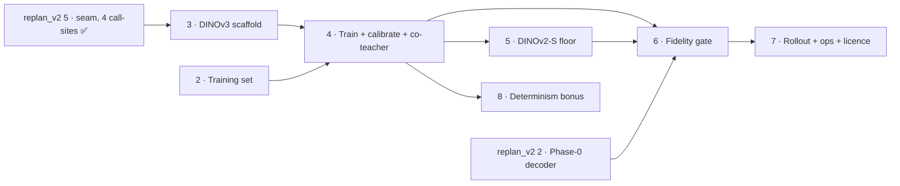

# DINOv3-SAT Scorer Swap — Execution Tracker

Source PRD: [`../dinov3_sat_scorer_backbone_prd.md`](../dinov3_sat_scorer_backbone_prd.md)
(READY — grilled Q1–Q10, 2026-06-30; **amended 2026-07-03** by the v2
program's §D12 — corrected inputs landed in the PRD and issues 02/03/04/06/07
via [`replan_v2/ISSUE-12`](../replan_v2/ISSUE-12-student-prd-amendments.md))

**Goal:** swap the install-date presence scorer backbone from hosted Gemini to a
self-hosted **frozen DINOv3-L-SAT** encoder + light head, **distilled from
Gemini's own per-vintage labels**. Primary deliverable = reproducibility (kill
version drift). Success is measured as **fidelity to Gemini, not accuracy** — no
independent install-date ground truth exists.

This effort is tracked as markdown issues in this folder. The repo plans entirely
in `docs/` markdown and the GitHub issue tracker is unused (PRD → Further Notes).

## Status legend

- ⬜ not started · 🟡 in progress · ✅ done · ⛔ blocked (a dependency is still open) · ➡ superseded (tracked elsewhere)

## Slices

| # | Slice | Status | Blocked by | Issue |
|---|-------|--------|-----------|-------|
| 1 | PresenceScorer seam — **superseded 2026-07-03** by [replan_v2 ISSUE-05](../replan_v2/ISSUE-05-presence-scorer-seam.md) (wider scope: 4 call-sites) | ➡ | — | [ISSUE-01](ISSUE-01-presence-scorer-seam.md) |
| 2 | Distillation training set (harvest + chip re-download + split) | ✅ | — | [ISSUE-02](ISSUE-02-distillation-training-set.md) |
| 3 | DINOv3-L-SAT frozen scorer scaffold + selection flag | ✅ | [replan_v2 5](../replan_v2/ISSUE-05-presence-scorer-seam.md) ✅ | [ISSUE-03](ISSUE-03-dinov3-scorer-scaffold.md) |
| 4 | Train light head + calibrate abstain band (RunPod; + co-teacher dual-scoring) | ✅ | 2, 3 | [ISSUE-04](ISSUE-04-train-head-calibrate.md) |
| 5 | DINOv2 ViT-S/14 falsification floor | ✅ | 4 | [ISSUE-05](ISSUE-05-dinov2-floor.md) |
| 6 | Fidelity gate (three numbers, both backbones; baseline = Phase-0 decoder under D8) — **DONE 2026-07-10**: gate-1 PASS both (self-repro 1.0); gate-2 FAIL both (`A_LSAT=0.6392`, `A_floor=0.6542` ≪ ceiling 0.7724, `S=0.0116`); gate-3 EQUIVALENT; SAT/L bet **FALSIFIED** (floor +1.5 pp). Verdict: [ISSUE-06-gate-verdict-2026-07-06](ISSUE-06-gate-verdict-2026-07-06.md). Gemini stays default → slice 7 still blocked on a future pass | ✅ | 4 ✅, 5 ✅, [replan_v2 2](../replan_v2/ISSUE-02-changepoint-posterior-decoder.md) ✅ | [ISSUE-06](ISSUE-06-fidelity-gate.md) |
| 7 | Feature-flag rollout + ops profile | ⛔ | 6 (gate-2 FAIL — no production swap) | [ISSUE-07](ISSUE-07-rollout-ops-profile.md) |
| 8 | Bonus: deterministic run-to-run experiment (not gated) | ⬜ | 4 | [ISSUE-08](ISSUE-08-determinism-experiment.md) |
| 9 | Path C0: training-free census-anchored reverse template matching (latent match + amended census-conditioned one-sided decode; new-prereg lane per revival memo) | ⛔ | 2026-07-15 mathematical amendment implementation + calibration lock + mandatory tests | [ISSUE-09](ISSUE-09-c0-reverse-template-matching.md) |
| 10 | Run3-native local line (research-only revival: 311,195-obs manifest, 3-state quality-marginalized emissions on the Phase-0 decoder, interval-level loss, marker-free ROI, localization gating layer; shelve-to-CapeTown rule) — licensed as a NEW prereg under the revival memo's "teacher geometry + re-distill" reopening condition; **owner-approved 2026-07-19** (gates + shelve rule + repeat-ceiling quota; LoRA/backbone veto maintained). **§9 foundations DELIVERED + R0 FROZEN & OWNER-CONFIRMED 2026-07-19** (311,195-obs manifest reconciled exact, `leakage_component_stratum_greedy` split, chip-overlap leakage graph deviation ratified with R0 sign-off; lock at `~/zasolar_data/geid_temporal/run3_native_line_2026-07/r0_manifest_v1/MANIFEST_LOCK.json`; TLO schema + cascade skeleton landed in `src/solar_backdating/localization/`). Phase-0 emission design is **APPROVED and implemented** ([DESIGN-phase0-emission-extension-2026-07-19](DESIGN-phase0-emission-extension-2026-07-19.md)); T0 is complete and leaves per-anchor fidelity open. **Wave 2 (R1/R2/repeat-ceiling) DELIVERED 2026-07-19**: R1 marker-free crops `r1_cropgeo_v1` (teacher byte-identical, [DATA-r1-crops](DATA-r1-crops-2026-07-19.md)); R2 cascade real (phase_corr+weak_lock, 2k replay; conflict handling remains off pending its separate shadow/blind protocol, [DATA-r2](DATA-r2-localization-replay-2026-07-19.md)); **new teacher ceiling 0.7708 ± 0.0166 (replaces 0.7724), <40 m² 0.7529 ± 0.0192** on frozen 576-anchor test panel, same instrument as RUN 3, old 0.65–0.67 provenance traced ([DATA-ceiling](DATA-run3native-repeat-ceiling-2026-07-19.md) §5.5). R4 prereg frozen 2026-07-20; training not started | 🔄 | — | [PRD-run3-native-local-line-2026-07-19](PRD-run3-native-local-line-2026-07-19.md) |

**Slice 10 Wave 3 update (2026-07-20):** crop geometry v2 is delivered as a
sidecar-driven, area-preserving rectangular ROI index with byte-identical v1
PNGs ([DATA-cropgeo-v2](DATA-cropgeo-v2-2026-07-19.md)); the DINOv2-S R3
baseline cache is complete and independently reconciled at 311,126 unique
features / 311,195 manifest rows, including real GPU kill→restart validation
([DATA-r3-feature-cache](DATA-r3-feature-cache-2026-07-19.md)); and the
conflict-gate redesign is FINAL as Design A′, with telemetry → shadow replay →
blind panel → kill evaluation still mandatory before any guard flip
([DESIGN-conflict-gate](DESIGN-conflict-gate-confidence-weighted-2026-07-19.md)).
The binding R4 training/calibration contract is now **FROZEN, NOT STARTED**
([RUN-r4 prereg](RUN-r4-training-calibration-prereg-2026-07-20.md)): v1 consumes
only the `r1_cropgeo_v1` cache; DINOv2-S stays frozen; three fixed seeds,
test-blind checkpoint/calibration/threshold rules, artifact schemas, and the
owner's bounded baseline + one-correction-per-failed-gate stop discipline are
locked. Slice 10 remains 🔄: next mainline step is the R4 implementation slice;
full training and R5 remain not started.

## Dependency graph



ASCII fallback:

```
        ┌──── replan_v2 5 ✅ ──► 3 ──┐
        │                            ▼
roots ──┤                            4 ──┬──► 5 ──┐
        │                            │   │        ▼
        └───────────────── 2 ────────┘   ├──► 6 ──► 7
                                         └──► 8 (bonus, not gated)
   (6 also needs 5 and replan_v2 2 — the Phase-0 decoder gate baseline)
```

Slice 1 was superseded by replan_v2 ISSUE-05 (done 2026-07-03), so slices 2
**and 3** are both unblocked roots now. Slice 6 gained an external dependency:
its no-answer-change baseline runs both pipelines through the Phase-0 decoder
(D12.vi).

## Execution waves

- **Wave A (parallel roots):** 2, 3 — the seam dependency is already ✅
  (replan_v2 ISSUE-05); run together.
  *Deviation note (2026-07-03):* the v2 PRD's phase-level ordering says
  "Phase 3 starts after 0 + 1 land (gate baseline + seam)". That is refined
  here to per-slice dependencies: the seam (Phase 1 side) is done, so slices
  2–3 may start; the Phase-0 decoder gates only slice 6 (its no-answer-change
  baseline, D12.vi) and must land before the fidelity gate runs.
- **Wave B:** 4 — after 2 **and** 3 (head training on RunPod).
- **Wave C (parallel):** 5, 8 — after 4.
- **Wave D:** 6 — after 4, 5, **and** replan_v2 2 (Phase-0 decoder).
- **Wave E:** 7 — after 6 (includes the pre-ship licence review).

## How to use this tracker

1. Pick a slice whose **Blocked by** entries are all ✅. Flip its status to 🟡.
2. Each issue is a **tracer bullet** — it must be verifiable on its own
   (its acceptance criteria pass: tests green / artifact exists / gate number
   reported) before it goes ✅. Check off criteria in the issue file as you land them.
3. On completion, flip the slice to ✅ here, append a dated line to the log, and
   re-scan for newly unblocked slices.
4. The **PRD stays authoritative** for decisions. If you deviate, record it as a
   note row below rather than silently editing scope.

## Decision invariants (carried from the PRD — do not drift)

- Frozen backbone, light head only. No full fine-tune in v1 (LoRA/PEFT only on gate failure).
- Distillation **matches** Gemini; accuracy is **out of the gate** (no truth exists).
- `scan_state.json` schema unchanged; `decision_source` values are additive.
- Gemini stays behind the same seam as fallback / A-B comparator; flag-gated, Gemini default until the gate passes.
- v1 = per-chip independent scoring, single global abstain band. Sequence-aware (c), census-GT reference exemplar (b), and per-sub-domain calibration are deferred.
- Region via explicit `region` + registry (ADR-0002). Weights + chips under `~/zasolar_data/`, not committed.
- **D12 amendments (2026-07-03) are binding:** label pool = 23,147 anchors /
  250,502 rounds (26,820 retired); `chip_targets.csv` is a hard re-render
  dependency; 27.6% `done_ambiguous_*` handled explicitly in stratification;
  training compute = RunPod; DINOv3 licence review pre-ship; gate baseline =
  Phase-0 decoder under D8 rules (hand-authored 0.74 retired); co-teacher
  dual-scoring = calibration instrument only. `pv_score` names only the seam
  field — on disk the field is `confidence`.

## Progress log

- 2026-07-20 — **Run3-native R4 prereg frozen; training not started.** Owner
  approved proceeding despite T0's aggregate-TVD premise failure because
  per-anchor fidelity remains untested, with one bounded v1 baseline and at
  most one hypothesis-led correction per failed G1/G2 gate. The binding RUN
  freezes the R0 manifest/splits and SHA checks, `d4104b9`'s
  `r1_cropgeo_v1` DINOv2-S cache, anchor-level train/calibration/test isolation,
  a 298,243-parameter two-head light model, approved three-state soft Phase-0
  decode, three seeds, test-blind calibration/threshold selection, R4 health
  verdicts, cropgeo-v2 isolation, and complete off-git artifact contracts:
  [RUN-r4-training-calibration-prereg-2026-07-20](RUN-r4-training-calibration-prereg-2026-07-20.md).
  No full training, feature generation, conflict-guard implementation, or
  production change was performed.

- 2026-07-16 — **ISSUE-09 (Path C0) consolidated final review + P0 amendment
  landed.** Cross-compared the archived external review against the 2026-07-15
  amendment with two independent verification passes
  ([`ISSUE-09-c0-final-review-2026-07-16.md`](ISSUE-09-c0-final-review-2026-07-16.md)):
  both binding fixtures reproduced bit-exact from the real decoder (shared root
  cause: the noise prior is derived from the signal it must detect); the M4
  weighted-likelihood adjudication confirmed by derivation and numerically
  (power vs proper marginal diverges materially under non-unit weights); M12's
  shift-search correction and the binary patch-center mask confirmed in code.
  Two P0 blockers found beyond the amendment and resolved same-day per
  [prereg Amendment 2026-07-16](DATA-c0-reverse-template-prereg-2026-07-12.md#c0-p0-amendment-2026-07-16):
  (1) `c0_r1` rule 2 rebuilt as a Jeffreys posterior gate
  `P(p>1/3|k,n) ≥ 0.95` with `n ≥ 150` (harness had a bare point estimate
  despite the prereg's "CI bounds respected"; verified: a CI reading of the
  old n=40 bar would demand 50% observed); (2) fresh-Gemini request identity
  completed — temperature/image-preprocessing/image-order now hashed into
  `prompt_config_hash` (intentional hash break, pre-launch), rendered batch
  prompt + image order persisted per attempt, chip_index order enforced
  fail-loud, and "batch mode sends no per-chip dates" documented in the RUN
  doc. Un-adopted external-review ideas registered as P1 (fractional token
  weights, exact-gap diagnostic, extra Stage-0 diagnostics, shift entropy) and
  P2 (multi-prototype bank, pairwise block changepoint, AnyChange, low-level
  channels, date-nuisance correction, Student-t) — each still requires its own
  pre-run amendment before entering the method.
- 2026-07-15 — **ISSUE-09 (Path C0) mathematical audit amendment adopted;
  current decoder blocked before Stage-0/held-out use.** Three independent
  mathematical reviews plus direct source-level reproduction found that the
  weighted NIG implementation is a power likelihood rather than the documented
  precision-scaled Gaussian; per-target empirical priors make canonical `T=3`
  steps amplitude-invariant and make larger exact `T=4` steps increasingly
  no-change; and the decoder can place clean interval mass after the known-
  present census date. New blockers beyond the original eight audit questions:
  template self-scoring contaminates smoke AUC and decode; the alternative is
  an unordered mean-and-variance change rather than an upward install step;
  `present_before_window` is an uncalibrated sign rule; the named isotonic
  cross-check is only GLR plus a direction veto; persistence can certify an
  alternating/reverting post sequence; and quality weights are inconsistent
  across filtering, likelihood, prior fitting, and mandatory cross-checks.
  The original concern that `log(total_days)` makes long windows favor
  no-change was refuted: for valid distinct day dates it already encodes fixed
  `P(H_empty)=0.5`. Binding amendment landed in
  [`DATA-c0-reverse-template-prereg-2026-07-12.md`](DATA-c0-reverse-template-prereg-2026-07-12.md#c0-math-amendment-2026-07-15):
  census-conditioned support; anchor leave-out; proper one-sided shared-
  variance precision-weighted regression; explicit boundary/failure states;
  separate detection/localization confidence; corrected weighted constrained
  cross-check and monotone persistence; `T=3–4` excluded from clean; strict
  dedup/domain checks; robust-ring/correlation sensitivities; applied phase
  registration, non-null anchor gate, train-only whitener, complete run hash;
  and 14 mandatory regression/property tests. Slice 9 moved from 🟡 to ⛔ until
  implementation, deterministic calibration/smoke manifests, numeric lock,
  and tests land. Existing 48 C0 tests still pass but are pre-amendment coverage
  only; no current decode result counts as prereg-conformant evidence.
- 2026-07-13 — **ISSUE-09 (Path C0) basemap96 stack adapter landed** (the
  basemap rebuild wiped every `scan_states` dir and legacy chip stack the
  2026-07-12 harness assumed; only `chip_targets.csv`/`chip_groups.gpkg`
  geometry survived). `pilot_c0_reverse_template_2026_07_12.py` embed/curve
  now support the rebuild's `basemap_rebuild_2026-07-13/chips/<target_id>/
  z<zoom>/<target_id>_<capture_ymd>_v<vintage_ymd>.tif` layout via
  `--stack-format basemap96`: per-frame `.tfw` world-file parsing (verified
  EPSG:3857, GEHI z19 tile resolution, cross-checked against
  `anchors_per_target_96m.csv`), exact TFW-projected footprint masks
  (`_footprint_mask_tfw`, replacing the aeqd approximation for this stack
  format), no render-crop (the per-target tif IS the geometry — new,
  distinct `geometry_version basemap96_z19_v1` so config-hash provenance
  can't conflate it with `chip_geom_v2_tight12`), and fail-closed per-frame
  skip handling for the concurrently-running download (missing `.tfw`,
  unreadable/partial `.tif`). **Finding en route:** the census polygon GPKG
  (`full382_merge01_2026-05-15/...gpkg`, `solar_predictions` layer) is
  EPSG:32735 (UTM 35S), not EPSG:4326 — the legacy `_footprint_mask`'s aeqd
  path hardcodes EPSG:4326 for this same GPKG and so silently mis-transforms
  it on every real target (always falls back to `radius_disk`); left
  untouched (out of scope), but the new TFW path reads the GPKG's own
  `.crs`. Smoke's label source (legacy scan-states, now dead) replaced by
  `--labels-csv` (manual target_id/frame_date/present-absent-unsure
  annotation) with an unchanged AUC≥0.75 / ≥60-anchor bar, plus a
  `--stage label_template` sampler (`n=150`, fixed seed 20260713, drawn from
  `gehi_vintage_candidates_pilot2023.csv`) that both emits the fill-in
  template and creates the main-eval exclusion (reserved-target) list —
  full methodology in the prereg's "Amendment 2026-07-13" sections. Verified
  end to end on 3 real targets with 2 downloaded vintages each: embed →
  curve ran clean (zero frame skips, `fp_source=tfw_polygon` on all 3,
  realized crop ~95-97 m vs nominal 96 m); decode correctly reports
  `insufficient_frames` (needs ≥3, download still in progress — expected,
  not a bug). Tests: `tests/validation/test_c0_pilot.py` extended from 27 to
  48 collected cases (TFW parsing/roundtrip, stack enumeration + skip reasons,
  polygon-to-grid projection incl. non-square-resize stretch, labels-CSV
  parsing, label-template sampling determinism, end-to-end smoke-with-CSV
  AUC); `tests/temporal/test_chip_geometry.py` extended for the new
  registry entry. Full repo gate: 1194 passed (one pre-existing, unrelated
  failure from the rebuild wiping `panel_repair_20260703/` data, confirmed
  via `git stash` to predate this work).
- 2026-07-12 — **ISSUE-09 (Path C0) opened** under the revival memo's
  new-prereg lane: training-free census-anchored reverse template matching
  (footprint patch-token latent match against latest same-sensor present
  frame + monotone changepoint decode). No trained head — does not reopen
  A/A′/A″/B (delta table in the issue). Round-2 literature survey dispatched
  (matching metric math, short-series changepoint methods, DINOv3 small-size
  matrix incl. SAT-domain availability). Prereg must land before any eval run.
  **Same day:** survey returned; prereg drafted —
  [DATA-c0-reverse-template-prereg-2026-07-12](DATA-c0-reverse-template-prereg-2026-07-12.md)
  (TCM footprint-vs-ring contrast + key-facet cosine + Bayesian
  single-changepoint posterior; smoke bar AUC ≥ 0.75; kill rule `c0_r1`).
  SAT-493M confirmed L/7B only → small-model arms must use web-domain
  DINOv3-S or DINOv2-S. Awaiting owner sign-off on numeric bars.
  **Owner reframe (same day):** no triage for now; banked Gemini verdicts
  are dirty (pre-rebuild) → C0 repositioned as a **paired independent
  channel** vs a fresh Gemini round on the rebuilt full-GEHI stacks
  (C0 locked blind first; judged by replicate-equivalence to fresh rep↔rep
  + blind disagreement adjudication). Prereg + ISSUE-09 updated. Smoke can
  run pre-rebuild; main eval waits on download + fresh round. Anchor rule
  refined (owner): nearest-frame both-sides around census date — right side
  eligible at any distance (low removal prior), left side only within
  12 months + anchor-consistency gate vs nearest right frame.
  **Harness landed (same day):**
  `scripts/validation/pilot_c0_reverse_template_2026_07_12.py` — stages
  embed/curve/decode/smoke live, eval = paired-vs-fresh stub (fails closed
  with instructions); `c0_s0`/`c0_r1` machine rules + tests green
  (48 passed, incl. existing gate suite). Blind-lock via config-hash-tagged
  artifacts + `lock_<tag>.json` sha256 manifest.
- 2026-07-10 — **Path A″ executed — SMOKE_GO then R3 KILL.** Harness
  `scripts/validation/pilot_anchor_pair_a2_2026_07_10.py`; artifacts
  `~/zasolar_data/geid_temporal/pilot_anchor_pair_a2_20260710/`. Same-sensor
  smoke n=63: median cos non-ref-present↔ref=**0.784** > early-absent 0.591
  > other-target 0.581 → GO. Heads trained CUDA, 3 seeds, param ratio 1.032.
  Arm P vs B pooled: TB FP 0.129 vs 0.104 (**−24%** red), FN 0.114 vs 0.115
  (+1.6%), overall agr 0.803 < 0.817. Machine `anchor_pair_a2_r1` KILL; no
  gate-2 re-run. H2 polarity fails (B best FP). **Pairing line fully closed**
  (A/A′/A″); with B also closed, frozen head-only student revival has no live
  path. Prereg+results:
  [DATA-anchor-pair-a2-same-sensor-prereg-2026-07-10](DATA-anchor-pair-a2-same-sensor-prereg-2026-07-10.md).
- 2026-07-10 — **Path A″ pre-registered (was live primary pairing bet).** Same-sensor
  latest teacher-`present` GEHI template; no Vexcel; patch-token head; smoke
  H3 then Arm P vs param-matched B (R3). Prereg:
  [DATA-anchor-pair-a2-same-sensor-prereg-2026-07-10](DATA-anchor-pair-a2-same-sensor-prereg-2026-07-10.md).
  Checker rule `anchor_pair_a2_r1` added.
- 2026-07-10 — **Path B sequence-level distillation pilot corrected and
  executed — B-R1 KILL; frame-bar FAIL.** Pre-reg + result:
  [DATA-sequence-head-pilot-prereg-2026-07-10](DATA-sequence-head-pilot-prereg-2026-07-10.md);
  harness `scripts/validation/pilot_sequence_head_2026_07_10.py`; artifacts
  `~/zasolar_data/geid_temporal/pilot_sequence_head_20260710_corrected/`.
  Target = cached raw Gemini verdicts decoded by the adopted Phase-0
  changepoint decoder (locked emissions + EB prior), not thresholded
  `label_3class`; the earlier unsuffixed artifact is invalidated audit-only.
  Frozen pooled 384-d embeddings; 2-layer temporal transformer (668,933 params) vs
  parameter-matched independent-frame control (668,746; ratio 1.00028), seeds
  0/1/2, all 163 heldout anchors, paired anchor-cluster bootstrap. Exact
  interval agreement improved 0.1963→0.2904 (Δ +0.0941, 95% CI
  +0.0491..+0.1391), but transition FP reduction was only 9.8% with CI crossing
  zero and FN worsened 0.0733→0.1258 (+71.7%). Overall decided agreement
  regressed 0.8340→0.8210. Arm A frame bar was only transition 0.7107 /
  overall 0.8210 (<0.90 both).
  Machine verdict KILL; no gate-2 rerun licensed and no rescue sweep.
- 2026-07-10 — **Pairing-v2 executed → H3 SMOKE_KILL (no head train).**
  Harness `pilot_anchor_pair_v2_2026_07_10.py`; artifacts
  `~/zasolar_data/geid_temporal/pilot_anchor_pair_v2_20260710/`. Patch grids
  extracted (8496 GEHI + 742 Vexcel). Domain-gap smoke n=80: median
  cos(late GEHI present, Vexcel)=**0.314**, cos(early absent, Vexcel)=0.214
  (ranking OK), cos(other Vexcel, Vexcel)=**0.888** → fails s_pos>s_neg.
  Cross-sensor template blocked under frozen dinov2. Path B becomes live
  primary student bet. Results in
  [DATA-anchor-pair-v2-prereg-2026-07-10](DATA-anchor-pair-v2-prereg-2026-07-10.md).
- 2026-07-10 — **Pairing-v2 pre-registered (polarity pivot).** Full lock:
  [DATA-anchor-pair-v2-prereg-2026-07-10](DATA-anchor-pair-v2-prereg-2026-07-10.md).
  Primary ref = **Vexcel census present**; domain-gap smoke before head train.
  Checker rule `anchor_pair_v2_r1` added. Architecture Phase-1 Siamese ban
  narrowed to pixel-space only.
- 2026-07-10 — **Anchor-pair pilot three-way review**
  ([DATA-anchor-pair-pilot-review-2026-07-10](DATA-anchor-pair-pilot-review-2026-07-10.md)):
  v1 R1 KILL **upheld as executed** but **scope-limited** — kills only
  global-pooled-embedding pairing with fixed earliest-absent anchor, single
  underpowered run; does **not** kill the pairing mechanism. Literature gaps:
  ChangeDINO/SemDINO difference dense multi-scale patch features (pilot
  pooled first); DeepSolar++ Siamese is known-PRESENT HR reference (reverse
  polarity); Kruitwagen load-bearing step is CNN→RNN (path B). Fair-test
  skeleton absorbed into pairing-v2 prereg (with Vexcel polarity pivot).
- 2026-07-10 — **Anchor-pair student pilot executed — R1 KILL (v1 variant).**
  Pre-reg
  [DATA-anchor-pair-pilot-prereg-2026-07-10](DATA-anchor-pair-pilot-prereg-2026-07-10.md);
  harness `scripts/validation/pilot_anchor_pair_2026_07_10.py`; artifacts
  `~/zasolar_data/geid_temporal/pilot_anchor_pair_20260710/`. Frozen
  dinov2_floor `nomarker_bilinear518_k6` embeddings; Arm A pair MLP
  `[cand, anchor, cand−anchor]` vs Arm B capacity-control MLP on `emb_cand`
  (seed=0, hidden 512/256). Eligible 756/764 anchors (inelig: 5
  `done_appears` + 3 `done_already_present_before_geid_history`). Report-half
  transition band (n=357): FP 14→13 (−7%), FN 14→12 (−14%) — both fail the
  ≥30% dual bar; overall decided-agr 0.812→0.816 and unusable-recall
  within −2pp pass. Slice-5 linear context: TB FP/FN 21/13. Superseded as
  the live frame bet by pairing-v2 (Vexcel present). Stage-B gate-2 re-run
  not licensed by v1.
- 2026-07-10 — **Gate-2 residual audit (a): hard-example strips + counterfactual
  on `done_appears`.** Script
  `scripts/validation/hard_example_strips_gate2.py`; DATA
  [DATA-hard-example-strips-done-appears-2026-07-10](DATA-hard-example-strips-done-appears-2026-07-10.md).
  Oracle frame repair (floor): baseline 0.45 → fix FP 0.58 → FP+unusable
  **0.59** (still −18 pp vs ceiling 0.77); FP+FN+unusable **0.80** clears
  ceiling; clean FP-only 0.69, clean FP+FN 0.87. Unusable forced-decide alone
  +1 pp on this stratum. Residual = bidirectional PA confusion, not unusable
  alone. HTML strips (28 units) under
  `~/zasolar_data/geid_temporal/fidelity_gate_20260710/hard_examples_done_appears_floor/`.
- 2026-07-10 — **Slice 6 DONE (gate executed).** Gate-1/2 full run on local
  RTX 4070 (zero API spend): teacher ceiling re-decoded from banked rep1–3;
  student re-scored after LOCKED `chip_geom_v2_tight12` nomarker re-render
  (0/14,002 render drops). Numbers:
  - Gate 1: self-repro **1.0** both backbones (PASS).
  - Teacher ceiling inv-weighted pairs 0.7708 / 0.7674 / 0.7790 → mean
    **0.7724**, spread `S=0.0116`.
  - `A_LSAT=0.6392`, `A_floor=0.6542` (mean over rep1–3, inv-weighted
    all-units) — both **FAIL** to reach ceiling (~12–13 pp short).
  - R1 bet-survival: `A_LSAT − A_floor = −0.0150 ≯ S` → **SAT/L FALSIFIED**;
    floor is the operative equivalent but **neither is a production swap**.
  - Gate 3 (pre-locked): EQUIVALENT 0.7971 vs 0.7968.
  Verdict filled: [ISSUE-06-gate-verdict-2026-07-06](ISSUE-06-gate-verdict-2026-07-06.md).
  Artifacts: `~/zasolar_data/geid_temporal/fidelity_gate_20260710/`.
  **Slice 7 remains blocked** (gate-2 FAIL; Gemini stays default). P4 /
  Panel v2 full rescan stay on Gemini quota. Harness gained the tight12
  nomarker re-render adapter in `fidelity_gate.py` (was identity — would have
  been OOD under the LOCKED input contract).
- 2026-07-10 — Slice 6 flipped 🟡: the student-vs-teacher offline fidelity
  harness landed (`c424efe`, `scripts/validation/fidelity_gate.py` + tests),
  the gate verdict skeleton with the pre-registered R1 tie-break is locked
  (`3ad2655`), and the student re-render input contract + render-drop policy
  addendum is locked pre-gate-2 (`a603e48`). **Gate 3 is already adjudicated
  EQUIVALENT** in the verdict skeleton (Δ = 0.029 pp < 1 SE ≈ 1.46 pp — the
  SAT/L bet is falsified on gate 3; locked from the ISSUE-04/05 artifacts,
  which predate the skeleton). Gates 1–2 (the actual run: reproducibility +
  bet-survival, both backbones) have not executed — ISSUE-06 header still
  says "Nothing below is done yet".
  Conditionality reminder (plan doc §5 P0-2): the verdict is conditional on
  banked96 geometry; Panel v2 re-render requires a cheap fidelity re-check of
  the winner, and a persisting tie defaults to DINOv2-S.
- 2026-06-30 — Tracker + 8 issue files created from the grilled PRD.
- 2026-07-03 — Slice 1 superseded by replan_v2 ISSUE-05 (seam landed across
  all four call-sites). D12 amendments landed in the PRD and issues
  02/03/04/06/07 (replan_v2 ISSUE-12): corrected label-pool counts,
  chip-manifest hard dependency, ambiguous-fraction stratification, RunPod
  compute, pre-ship licence review, gate re-based on the Phase-0 decoder
  under D8, co-teacher dual-scoring. Slice 3 unblocked; slice 6 gained
  replan_v2 2 (decoder) as a baseline dependency.
- 2026-07-05 — Slice 2 done: `build_distillation_set.py` (harvest +
  render-chips, 27 tests). 23,147 anchors / 298,239 post-dedup rounds across
  all four corpora (D12's 250,502 was an inconsistent subset — reconciled in
  the artifact README); 27.6% `done_ambiguous_*` retained as unusable;
  anchor-disjoint split 18,499/4,648; 800-anchor stratified subset re-rendered
  at `chip_geom_v2_tight12` (8,165 rounds, 763 unrecoverable drops recorded),
  idempotency + containment-band QA verified on real artifacts. Artifacts:
  `~/zasolar_data/geid_temporal/dinov3_distill_20260705/`. **Slice 4 (train
  head) is now unblocked** (2 ✅ + 3 ✅ — Wave B may start).
- 2026-07-05 — Slice 4 done: light head trained (frozen backbone) + calibrated
  on RunPod (RTX 5090, D12.iv). Winner **`nomarker_bilinear512_k6`** (input 512,
  center-pool-k 6, bilinear), band **lo=0.46/hi=0.50**, pinned at
  `~/zasolar_data/models/dinov3_sat/head_v1_20260705/` (sha256-verified). Honest
  **held-out report-half agreement = 0.797 @ 0.885 coverage** (calib-half 0.939
  is in-sample — ~14 pp optimism gap on an 82-anchor calib set; downstream cites
  0.797). Upscaling ablation: bilinear≡bicubic@256, 512/k6 wins by +0.42 pp, the
  marked arm (+0.6–1 pp) is a D4-forbidden diagnostic only. Co-teacher: 35
  strata, overall disagreement 0.237, per-stratum table archived for Phase-4.
  Weak spot: thin unusable-class recall (20/120 report rows). Two design
  decisions (unusable-class supervision via 1,252 quality rows composing D12.iii;
  marker-free `.nomarker.png` render, PRD D4) + a fixed latent CUDA scaffold bug
  recorded in ISSUE-04 execution notes. `score()` now emits the calibrated band
  (local GPU seam smoke green; 76 slice-4 tests pass). **Slices 5 (DINOv2 floor)
  and 8 (determinism bonus) unblocked — Wave C may start.**
- 2026-07-05 — Slice 5 done: DINOv2 ViT-S/14 falsification floor stood up
  entirely on the **local RTX 4070 8GB** (no pod — 22M-param backbone, peak
  VRAM ~0.37 GB), same seam, same ISSUE-02 splits, same ISSUE-04 recipe.
  Implemented as `Dinov2PresenceScorer`, a thin subclass of
  `Dinov3PresenceScorer` in `dinov3_scorer.py` (file-scope forbade a new
  module); patch size (14 vs 16) derived torch-free from the timm backbone id;
  `dynamic_img_size=True` added (byte-identical for DINOv3, required for
  DINOv2's non-518 default); registered additively as `dinov2_floor`/
  `dinov2_failed`, selectable via the existing `--scorer` flag with zero
  CLI-surface change (Gemini stays default). Winner **`nomarker_bilinear518_k6`**
  (same shape as slice 4's winner), band **lo=0.35/hi=0.41**, pinned at
  `~/zasolar_data/models/dinov2_floor/head_v1_20260705/` (sha256-verified).
  Honest **held-out report-half agreement = 0.7968 @ 0.8776 coverage, n=858**
  (calib-half 0.9495 is in-sample, not cited as headline) — cf. DINOv3-L-SAT's
  0.797 @ 0.885 (ISSUE-04); this slice does not judge the comparison, that's
  ISSUE-06's job. Seam smoke on real weights (GPU) green; 90/90 targeted tests
  pass (`test_dinov3_scorer.py` + `test_train_dinov3_head.py` +
  `test_dinov2_floor.py`). Cosmetic anomaly fixed pre-commit: the shared
  evaluate-report writer used to hardcode a "DINOv3 head ... (ISSUE-04)" title
  even when scoring the DINOv2 bundle (numbers/config in the body were always
  correct); the title now derives from `config.backbone_model_id`, and the
  pinned report was regenerated (verified byte-identical apart from the title).
  **Slice 6 (fidelity gate) still waits on `replan_v2` ISSUE-02 (Phase-0
  decoder baseline); slice 4 + 5 sides of its dependency are now both ✅.**
- 2026-07-04 — Slice 3 done: scaffold landed
  (`scripts/temporal/dinov3_scorer.py` — frozen timm
  `vit_large_patch16_dinov3.sat493m`, center-k×k token pooling, fixed-seed
  placeholder Linear head, weights cached under
  `~/zasolar_data/models/dinov3_sat/`), registered as `--scorer dinov3_frozen`
  behind the seam (Gemini default unchanged), 11 tests incl. real-weight
  backbone parity, determinism, downstream byte-identical scan_state
  invariance. All acceptance criteria checked off in ISSUE-03. Slice 4
  (train head) now waits only on slice 2 (training set).
- 2026-07-05 (correction to the slice-5 entry above) — the line "Slice 6 …
  still waits on `replan_v2` ISSUE-02 (Phase-0 decoder baseline)" is **stale as
  written**. `replan_v2` ISSUE-02 (changepoint posterior decoder) is
  `Status: done` (2026-07-03) and has since been **adopted as the production
  default** via DECISION-A (2026-07-04) → PRD-AMENDMENT-P1 Option A (signed
  2026-07-05) → ISSUE-22/D19 (commits `cbf4f4e` + `00fdcd7`). So **all three
  slice-6 blockers are now satisfied**: slice 4 ✅, slice 5 ✅ (committed
  `0d1aad4`), `replan_v2` ISSUE-02 ✅. **Slice 6 (fidelity gate) is READY to
  start** — see the readiness map + file-level execution design in
  [`ISSUE-06-prep-2026-07-05.md`](ISSUE-06-prep-2026-07-05.md). Honesty carried
  into the gate verdict (do not sanitize): the gate-#2 baseline decoder's own
  record is hard-MAP year-TVD **NO-GO** (store-backed re-run flat
  `[0.079/0.040/0.076]`; EB prior worse) → **Option-A caliber flip** to the
  survival/fractional channel (passes, beats point-date) → ISSUE-21 band
  re-derivation as **condition-subsequent**. Slice 6 does **not** wait on
  ISSUE-21 (different caliber/channel; decoder already pinned;
  decoder-choice-invariant by construction) and needs **no new API budget** (the
  teacher rep↔rep ceiling re-decodes banked verdicts on CPU; the student
  re-scores banked chips on the local GPU). Note also (superseding the prep
  recon's snapshot): the ISSUE-21 rep4/rep5 re-band run has **completed**
  (both `EXITCODE=0`); the slice-6 executor must still treat
  `llm_endtoend_storebacked_20260704/` as owned by the concurrent ISSUE-21
  session and write gate outputs to a fresh dir.
