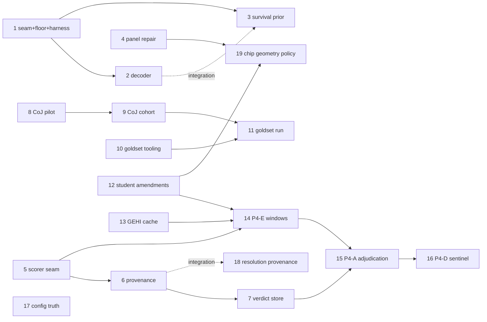

# Install-Date Optimization v2 — Execution Tracker

Source PRD: [`../install_date_optimization_v2_prd.md`](../install_date_optimization_v2_prd.md)
(READY, 2026-07-03) · Source analysis: [`../install_date_optimization_replan_2026-07-03.md`](../install_date_optimization_replan_2026-07-03.md)

**Goal:** reproducible-and-bounded-accurate install dates via five layered
phases — deterministic decoder (P0), provenance + verdict store (P1), external
accuracy channel (P2), corrected student distillation (P3, governed by the
[dinov3 tracker](../dinov3_scorer/TRACKER.md)), and the fixed-grid pipeline
shape E→A→D (P4).

The repo plans entirely in `docs/` markdown; the GitHub issue tracker is
unused. **Markdown is the single source of truth.** After editing any
`ISSUE-*.md` `Status:` line (or this file), regenerate the HTML view:

```bash
python3 docs/replan_v2/render_tracker.py   # writes docs/replan_v2/tracker.html
```

## Status vocabulary

`Status:` line in each issue file: `ready-for-agent` · `ready-for-human` ·
`in-progress` · `done` · `wontfix`. An issue is **effectively blocked** when
any dependency is not `done` (computed by the renderer, not hand-maintained).

## Slices

| # | Slice | Phase | Status | Blocked by |
|---|-------|-------|--------|-----------|
| 1 | [Estimator seam + PAVA floor + harness](ISSUE-01-estimator-seam-floor-harness.md) | 0 | done | — |
| 2 | [Changepoint posterior decoder](ISSUE-02-changepoint-posterior-decoder.md) | 0 | ready-for-agent | 1 |
| 3 | [Turnbull survival prior + aggregation](ISSUE-03-turnbull-survival-prior.md) | 0 | ready-for-agent | 1 (integration: 2) |
| 4 | [Reliability panel repair](ISSUE-04-reliability-panel-repair.md) | 0 | done | — |
| 5 | [PresenceScorer seam, 4 call-sites](ISSUE-05-presence-scorer-seam.md) | 1 | done | — |
| 6 | [Provenance sidecar](ISSUE-06-provenance-sidecar.md) | 1 | ready-for-agent | 5 |
| 7 | [Verdict store + replay + churn](ISSUE-07-verdict-store.md) | 1 | ready-for-agent | 6 |
| 8 | [CoJ audit pilot (tracer)](ISSUE-08-coj-audit-pilot.md) | 2 | ready-for-agent | — |
| 9 | [CoJ audit cohort scale](ISSUE-09-coj-audit-cohort.md) | 2 | ready-for-agent | 8 |
| 10 | [Gold-set tooling (jump-point UI)](ISSUE-10-goldset-tooling.md) | 2 | ready-for-agent | — |
| 11 | [Gold-set adjudication + accuracy report](ISSUE-11-goldset-adjudication-run.md) | 2 | ready-for-human | 9, 10 |
| 12 | [Student PRD amendments (D12)](ISSUE-12-student-prd-amendments.md) | 3 | done | — |
| 13 | [GEHI availability-catalog cache](ISSUE-13-gehi-availability-cache.md) | 4 | ready-for-agent | — |
| 14 | [P4-E student-selected windows](ISSUE-14-p4e-student-selected-windows.md) | 4 | ready-for-agent | 5, 12, 13 (+dinov3 slice 3) |
| 15 | [P4-A bounded adjudication](ISSUE-15-p4a-bounded-adjudication.md) | 4 | ready-for-agent | 7, 14 (+dinov3 slice 6) |
| 16 | [P4-D sentinel decay](ISSUE-16-p4d-sentinel-decay.md) | 4 | ready-for-agent | 15 |
| 17 | [Config truth: dead-knob removal + zoom single-source](ISSUE-17-config-truth-cleanup.md) | 1 | done | — |
| 18 | [Resolution provenance + cache escape](ISSUE-18-resolution-provenance-cache-escape.md) | 1 | done | — (integration: 6) |
| 19 | [Chip-geometry policy at Phase-3 re-render](ISSUE-19-chip-geometry-policy.md) | 3 | ready-for-agent | 4, 12 |

Unblocked start set: **2, 6, 8, 10, 13, 19** (3 partially: integration needs 2). Done so far: 1, 4, 5, 12, 17, 18.

Slices 17–19 were added 2026-07-03 from the chip-geometry & resolution audit
(PRD amendment block, D16–D18): dead YAML sections, first-cached-zoom
pinning, and the never-shipped adaptive chip size.

Phase 3 implementation slices (training set, scaffold, head training, DINOv2-S
floor, fidelity gate, rollout) remain tracked in
[`../dinov3_scorer/TRACKER.md`](../dinov3_scorer/TRACKER.md); its slice 1 is
superseded by slice 5 here.

## Dependency graph


