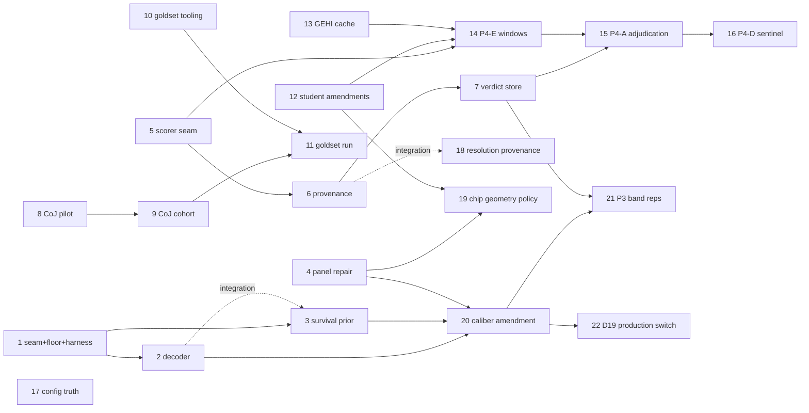

# Install-Date Optimization v2 — Execution Tracker

Source PRD: [`../install_date_optimization_v2_prd.md`](../install_date_optimization_v2_prd.md)
(READY, 2026-07-03) · Source analysis: [`../install_date_optimization_replan_2026-07-03.md`](../install_date_optimization_replan_2026-07-03.md)

**Goal:** reproducible-and-bounded-accurate install dates via five layered
phases — deterministic decoder (P0), provenance + verdict store (P1), external
accuracy channel (P2), corrected student distillation (P3, governed by the
[dinov3 tracker](../dinov3_scorer/TRACKER.md)), and the fixed-grid pipeline
shape E→A→D (P4).

The repo plans entirely in `docs/` markdown; the GitHub issue tracker is
unused. **Markdown is the single source of truth.** After editing any
`ISSUE-*.md` `Status:` line (or this file), regenerate the HTML view:

```bash
python3 docs/replan_v2/render_tracker.py   # writes docs/replan_v2/tracker.html
```

## Status vocabulary

`Status:` line in each issue file: `ready-for-agent` · `ready-for-human` ·
`in-progress` · `done` · `wontfix`. An issue is **effectively blocked** when
any dependency is not `done` (computed by the renderer, not hand-maintained).

## Slices

| # | Slice | Phase | Status | Blocked by |
|---|-------|-------|--------|-----------|
| 1 | [Estimator seam + PAVA floor + harness](ISSUE-01-estimator-seam-floor-harness.md) | 0 | done | — |
| 2 | [Changepoint posterior decoder](ISSUE-02-changepoint-posterior-decoder.md) | 0 | done | 1 |
| 3 | [Turnbull survival prior + aggregation](ISSUE-03-turnbull-survival-prior.md) | 0 | done | 1 (integration: 2) |
| 4 | [Reliability panel repair](ISSUE-04-reliability-panel-repair.md) | 0 | done | — |
| 5 | [PresenceScorer seam, 4 call-sites](ISSUE-05-presence-scorer-seam.md) | 1 | done | — |
| 6 | [Provenance sidecar](ISSUE-06-provenance-sidecar.md) | 1 | done | 5 |
| 7 | [Verdict store + replay + churn](ISSUE-07-verdict-store.md) | 1 | done | 6 |
| 8 | [CoJ audit pilot (tracer)](ISSUE-08-coj-audit-pilot.md) | 2 | done | — |
| 9 | [CoJ audit cohort scale](ISSUE-09-coj-audit-cohort.md) | 2 | done | 8 |
| 10 | [Gold-set tooling (jump-point UI)](ISSUE-10-goldset-tooling.md) | 2 | done | — |
| 11 | [Gold-set adjudication + accuracy report](ISSUE-11-goldset-adjudication-run.md) | 2 | ready-for-human | 9, 10 |
| 12 | [Student PRD amendments (D12)](ISSUE-12-student-prd-amendments.md) | 3 | done | — |
| 13 | [GEHI availability-catalog cache](ISSUE-13-gehi-availability-cache.md) | 4 | done | — |
| 14 | [P4-E student-selected windows](ISSUE-14-p4e-student-selected-windows.md) | 4 | ready-for-agent | 5, 12, 13 (+dinov3 slice 3) |
| 15 | [P4-A bounded adjudication](ISSUE-15-p4a-bounded-adjudication.md) | 4 | ready-for-agent | 7, 14 (+dinov3 slice 6) |
| 16 | [P4-D sentinel decay](ISSUE-16-p4d-sentinel-decay.md) | 4 | ready-for-agent | 15 |
| 17 | [Config truth: dead-knob removal + zoom single-source](ISSUE-17-config-truth-cleanup.md) | 1 | done | — |
| 18 | [Resolution provenance + cache escape](ISSUE-18-resolution-provenance-cache-escape.md) | 1 | done | — (integration: 6) |
| 19 | [Chip-geometry policy at Phase-3 re-render](ISSUE-19-chip-geometry-policy.md) | 3 | done | 4, 12 |
| 20 | [Cohort deliverable caliber amendment (D19)](ISSUE-20-deliverable-caliber-amendment.md) | 0 | done | — |
| 21 | [P3 band re-derivation reps](ISSUE-21-p3-band-rederivation.md) | 0 | done | 20, 7 |
| 22 | [D19 production switch (remaining §8 code items)](ISSUE-22-d19-production-switch.md) | 0 | done | 20 |
| 23 | [GEHI displacement + tight12 contamination audit](DATA-gehi-displacement-audit-2026-07-06.md) | 3 | done | 19 |
| 24 | [Learned feature matching (SuperPoint+LightGlue / LoFTR) for weak-lock registration](ISSUE-24-learned-feature-matching.md) | 3 | ready-for-agent | — |

Slice 24 note (2026-07-08): opened to replace the DINO-coarse dense-token
matcher (killed same day — best 39.4% recovery on the 137-row positive
control, vs. a pre-registered 70–80% bar; see
[DATA-dino-coarse-bounded-kill-2026-07-08.md](DATA-dino-coarse-bounded-kill-2026-07-08.md))
with a purpose-built learned correspondence matcher (SuperPoint+LightGlue
first, LoFTR as a fallback arm) on the same 2,785-row/679-anchor PSR<12
weak-lock population from ISSUE-23. Explicitly scoped as a bounded,
pre-registered pilot from the start — reuses the same 137-row positive
control and kill-bar discipline the DINO line only adopted in its third
session. Unrelated to the still-untested "arm 0"/"arm 1" non-learned levers
(search-window widening / weak-lock calibration) flagged in the same memo.

Unblocked start set: **11** (human — ISSUE-10 landed 2026-07-05 with a
10-anchor dry run adjudicated, n=500 recommended; precondition: extend
dispute-anchor strips to source the full-stack arm's frames, see the
ISSUE-10 evening progress note) · ~~**21** (human gate: ~2-rep API budget —
band formula registered 2026-07-05, mean ± 2 sd,
[ISSUE-21-band-prereg-2026-07-05.md](ISSUE-21-band-prereg-2026-07-05.md))~~
**DONE 2026-07-05** (rep4/rep5 ran; band [0.0243, 0.0787] frozen; rollback
trigger PASS 0/10 — DECISION-A second addendum);
14 unblocked on the replan side (dinov3 slice 3 landed 2026-07-04); 15
additionally needs 14). ISSUE-08 and
**ISSUE-09 are both done** — the full 16,166-unit CoJ cohort run completed
2026-07-05 11:52 NZST (tmux `coj_cohort`; fetch→score→join→gates→report,
resumed idempotently after a Windows reboot killed the chain mid-score at
02:26). Coverage 12,190/12,190 dated anchors = 100%, zero fetch failures;
gate_nc PASS (1/300 false-present, Wilson CI [0.001, 0.019]). gate_a fails
in exactly one cell (`c_cal_present_pre2019@2015`, 49/55 = 0.891 vs bar
0.95) — all six disagreements were human-adjudicated 2026-07-05, splitting
3/3 between backdating_early (incl. a heater_swap failure mode — GEHI
change detection anchored on a pool heater that predates the PV) and
audit_miss_2015; the 2015 layer is downweighted (~5% FN), not voided, and
2023 stays the clean primary layer
(`~/zasolar_data/geid_temporal/coj_audit_cohort_20260704/gate_a_2015_human_adjudication.{csv,md}`).
The 8,407-bit `human_queue.csv` is ready for the gold-set channel. Done so
far: 1, 2, 3, 4, 5, 6, 7, 8, 9, 10, 12, 13, 17, 18, 19, 20, 21, 22, 23.
Slice 23 note (2026-07-06/07): the displacement audit measured GEHI-vs-Vexcel
cross-vintage/absolute misregistration on the 792-anchor zero-download corpus
(788 distill decision-set + 4 panel_repair dense stacks; 15,501 rows,
`EXIT=0`). Median absolute offset against the census/crop frame is <1 m, but
tight12 contamination is material and size-concentrated: medium/large
installs (footprint ≥40 m²) lose >50% of the panel footprint from the crop in
~13–15% of frames (~4% full loss), while `chip_geom_v1_banked96` is
essentially immune (0% lose>50% at every PSR reliability cut). This **revisits
ISSUE-19's closed geometry decision with new evidence**: before the Phase-3
re-render runs on medium/large-footprint anchors, either register a
size-stratified geometry version (the registry's own foreseen
`chip_geom_v3_tight_scaled`) or add per-vintage local re-centering as a new
named `geometry_version` — never a hotfix to cached tight12 rows or the frozen
96 m builder (D18). Also implements the `best_offset_m`/`alignment_score`
fields the Phase-0 architecture doc asked for and nothing had shipped
(`per_chipdate_offsets.csv`, keyed `chip_id+capture_date+ref_kind`, joinable
without touching the frozen builder). Full findings:
[DATA-gehi-displacement-audit-2026-07-06.md](DATA-gehi-displacement-audit-2026-07-06.md).
ISSUE-19 note (2026-07-04): Phase-3 re-render geometry decided —
`chip_geom_v2_tight12` (ISSUE-04 tight-crop arm, 0.5/12 m/256 px) is the
re-render default, `chip_geom_v1_banked96` stays the frozen legacy default;
registry `scripts/temporal/chip_geometry.py` + `--chip-geometry` provenance
wiring; decision memo
([ISSUE-19-geometry-decision-2026-07-04.md](ISSUE-19-geometry-decision-2026-07-04.md))
passed an adversarial audit **sound-with-caveats** — the memo assigns dinov3
ISSUE-02 two obligations (teacher-label geometry disposition + guard-band QA
spot-check). ISSUE-02 note: the endtoend year-TVD gate was re-run
on store-backed reps 2026-07-04 (`llm_endtoend_storebacked_20260704/`) —
the hard-MAP band was **still not met** (flat [0.079/0.040/0.076]; EB prior
worsens it) and DECISION-A adjudicated **NO-GO** under the hard-MAP caliber
([DECISION-A-estimator-adoption-2026-07-04.md](DECISION-A-estimator-adoption-2026-07-04.md));
that verdict is since **qualified/flipped under the fractional deliverable
definition (D19)**: the owner signed the P1 amendment (**Option A,
2026-07-05**), the operative gate is now the survival/fractional channel
(passes and beats point-date), and the production default is the decoder +
EB prior with the P3 re-band as condition-subsequent
([PRD-AMENDMENT-P1-posterior-mass-caliber-2026-07-04.md](PRD-AMENDMENT-P1-posterior-mass-caliber-2026-07-04.md)).
Slice 20 was added 2026-07-04 from DECISION-A's P1/P3 pre-registered path
(PRD amendment block, D19); slice 21 tracks the P3 band re-derivation reps.
ISSUE-03 note: the shipped EB
prior lifts the decoder above its ISSUE-02 record (mode-hit 0.905→0.942);
downstream cohort curves DO carry the C5 caveat (2024 mass dip =
imagery-clamp artifact, not a market signal).

Slices 17–19 were added 2026-07-03 from the chip-geometry & resolution audit
(PRD amendment block, D16–D18): dead YAML sections, first-cached-zoom
pinning, and the never-shipped adaptive chip size.

Phase 3 implementation slices (training set, scaffold, head training, DINOv2-S
floor, fidelity gate, rollout) remain tracked in
[`../dinov3_scorer/TRACKER.md`](../dinov3_scorer/TRACKER.md); its slice 1 is
superseded by slice 5 here.

## Dependency graph


